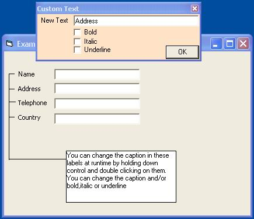



## ctLabel\. Give users control

### Description

This control allows your users to change the label captions of your fields at run time. I think this is a unique aproach and concept to customized legends. A lot of my customers sometimes don't agree with the captions I use on certain forms (nitty gritty:) so I sat down one afternoon and cooked this activex. Is not very commented but the code is very simple and easy to follow. This is a quicky control, and if you like it then I will try and improve it. This is the very first time I upload a code to planet source and any comments will be highly appreciated and motivate me for more uploads. Thanks !!
 
### More Info
 
This code uses a connection to a database through ADO, but it is very simple and only basic visual basic programming is needed.

             |
---                |---
**Submitted On**   |2003-02-18 13:28:28
**By**             |[Makis Charalambous](https://github.com/Planet-Source-Code/PSCIndex/blob/master/ByAuthor/makis-charalambous.md)
**Level**          |Beginner
**User Rating**    |4.0 (24 globes from 6 users)
**Compatibility**  |VB 6\.0
**Category**       |[Custom Controls/ Forms/  Menus](https://github.com/Planet-Source-Code/PSCIndex/blob/master/ByCategory/custom-controls-forms-menus__1-4.md)
**World**          |[Visual Basic](https://github.com/Planet-Source-Code/PSCIndex/blob/master/ByWorld/visual-basic.md)
**Archive File**   |[ctLabel1546522182003\.zip](https://github.com/Planet-Source-Code/makis-charalambous-ctlabel-give-users-control__1-43323/archive/master.zip)

